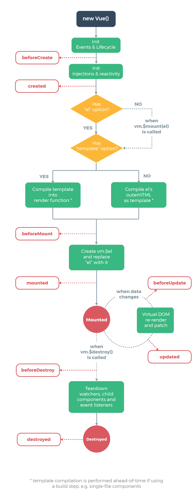

# Vue life Cycle

  Vue.JS의 라이프 사이클은 크게 Create, Mount, Update, Destory로 나눌 수 있습니다.




## 1. Create

  Vue.JS의 라이프 사이클들 중에 가장 먼저 실행됩니다. create 단계에서 실행되는 라이프 사이클 훅(hook)들은 컴포넌트가 DOM에 추가 되기 전이기 때문에, DOM에 접근하거나 `this.$el`을 사용할 수 없습니다. 컴포넌트가 DOM에 추가 되기 전에 호출 되기 때문에 서버 사이드 렌더링에서도 지원되는 훅입니다. Create 단계에서 호출되는 라이프 사이클 훅들은 `beforeCreate`와 `created`가 있습니다.

### beforeCreate

Vue.JS의 라이프 사이클 훅 중에서 가장 먼저 실행 되는 훅입니다. data와 이벤트(`$on`, `$once`, `$off`, `$emit`), 감시자(`$watch`)등이 설정 되기 전에 호출되는 라이프 사이클 훅입니다.

```javascript
export default {
  data() {
    return {
      title: 'Vue.JS'
    };
  }
  beforeCreate() {
    // data(this.title)와 이벤트($on ...) 감시자($watch)를 사용할 수 없습니다.
    console.log('beforeCreate');
  }
}
```


### created

  `data`, `computed`, `methods`, `watch` 등과 같은 옵션 설정이 완료된 시점이기 때문에, `data` 등을 사용할 수 있습니다. 하지만 아직 DOM에 컴포넌트가 마운트 되지 않았기 때문에 `$el`은 사용할 수 없습니다.

```javascript
export default {
  data() {
    return {
      title: 'Vue.JS'
    };
  },
  computed: {
    titleComputed() {
      return 'After Computed : ' + this.title;
    }
  },
  created() {
    // data(this.title), computed(this.titleComputed), methods... 등을 사용할 수 있지만,
    // DOM이 마운팅 되기 전이기 때문에 $el은 사용할 수 없습니다.
    console.log(this.title, this.titleComputed);
  }
}
```


## 2. Mount

  컴포넌트가 DOM에 추가될 때, 실행되는 라이프 사이클 훅입니다. 서버 사이드 렌더링을 지원하지 않습니다. 렌더링이 될 때 DOM을 변경하고 싶다면 이 라이프 사이클 훅을 사용할 수 있습니다. 하지만 컴포넌트 초기에 `data`가 세팅되어야 한다면, `created` 라이프 사이클 훅을 사용하는 것이 좋습니다. Mount 단계에서 호출되는 라이프 사이클 훅들은 `beforeMount`와 `mounted`가 있습니다.

### beforeMount

  컴포넌트가 DOM에 추가 되기 직전에 실행되는 훅입니다. 서버 사이드 렌더링을 지원하지 않습니다. 컴포넌트 초기에 `data`가 세팅되어야 한다면 `created` 라이프 사이클 훅을, 렌더링 되고 DOM을 변경해야 한다면 `mounted` 라이프 사이클 훅을 사용하면 되기 때문에, 거의 사용하지 않는 라이프 사이클 훅입니다.

```javascript
export default  {
  beforeMount() {
    // $el은 아직 사용할 수 없습니다.
  }
}
```

### mounted

  컴포넌트가 DOM에 추가 된 후 호출되는 라이프 사이클 훅입니다. 서버 사이드 렌더링은 지원하지 않습니다. `$el`을 사용하여 DOM에 접근 할 수 있습니다. `mounted` 훅이 호출되었다고 모든 컴포넌트가 마운트 되었다고 보장할 수는 없습니다. 전체가 렌더링 보장된 상태에서 작업을 하기 위해서는 `$nextTick`을 사용해야 합니다.

```javascript
export default {
  mounted() {
    // $el 을 사용할 수 있습니다.
    console.log('mounted', this.$el);
    this.$nextTick(() => {
      // 모든 화면이 렌더링된 후 호출됩니다.
    });
  }
}
```

  자식 컴포넌트의 `mounted` 훅이 부모 컴포넌트의 `mounted` 훅 보다 먼저 실행됩니다.


  `created` 훅은 부모 -> 자식 순으로 호출 되지만, `mounted` 훅은 자식 -> 부모 순으로 호출됩니다. 즉 부모 컴포넌트는 자식 컴포넌트가 모두 DOM에 추가 된 후에야 `mounted` 훅이 실행됩니다.

```javascript
const Child = {
  template: '<div>Child</div>',
  mounted() {
    console.log('Child Component Mounted');
  }
}
 
new Vue({
  el: '#app',
  mounted() {
    console.log('Parent Component Mounted');
  },
  components: {
    Child
  }
});
```


## 3. Update

  컴포넌트에서 사용되는 속성들이 변경되는 등의.. 컴포넌트가 재 랜더링 되면 실행되는 라이프 사이클 훅입니다. 컴포넌트가 재 렌더링 될 때, 변경 된 값으로 어떠한 작업을 해야 할 때 유용하게 사용 되는 훅입니다. 서버 사이드 렌더링은 지원하지 않습니다.

### beforeUpdate

  DOM이 재 렌더링 되기 직전에 호출되는 라이프 사이클 훅입니다. 업데이트 된 값들을 가지고 있는 상태이기 때문에, 업데이트 된 값으로 다른 값들을 업데이트 할 수 있습니다. 이 훅에서 값이 변경되더라도 다시 `beforeUpdate` 훅이 호출 되지 않기 때문에, 무한 루프에 빠질 걱정은 하지 않으셔도 됩니다.

```javascript
export default {
  beforeUpdate() {
    console.log('beforeUpdate');
  }
}
```

### updated

  DOM이 재 렌더링 된 후 호출되는 라이프 사이클 훅입니다. DOM이 업데이트 된 후 호출 되는 훅이기 때문에 변경 된 후의 DOM을 이용해야 하는 처리를 할 때 사용하기 유용한 훅입니다. `mounted` 훅과 마찬가지로 재 렌더링이 끝났다는 것이 보장된 상태에서 작업하기 위해서는 `$nextTick`을 사용해야 합니다. `beforeUpdate` 훅과 다르게 `updated` 훅에서 `data`를 수정하게 되면 `update` 훅이 호출 되기 때문에 무한 루프에 빠질 수 있으니 유의해야 합니다.

```javascript
export default {
  updated() {
    console.log('updated');
    this.$nextTick(function () {
      // 모든 화면이 렌더링된 후 실행합니다.
    });
  }
}
```


## 4. Destroy

컴포넌트가 제거 될 때 실행되는 라이프 사이클 훅입니다.

### beforeDestroy

  컴포넌트가 제거 되기 직전에 호출되는 라이프 사이클 훅입니다. 이 훅에서 컴포넌트는 본래의 기능들을 가지고 있는 온전한 상태입니다. 이 훅에서 이벤트 리스너를 해제하거나 컴포넌트에서 동작으로 할당 받은 자원들은 해제해야 할 때 사용하기 적합한 훅입니다. 서버 사이드 렌더링을 지원하지 않습니다.

```javascript
export default {
  beforeDestroy() {
    console.log('beforeDestory');
  }
}
```


## 추가 GitHub 소스

예제링크

[vue 라이플 사이클 예제]: https://github.com/beomy/vue-life-cycle	"vue 라이플 사이클 예제"


